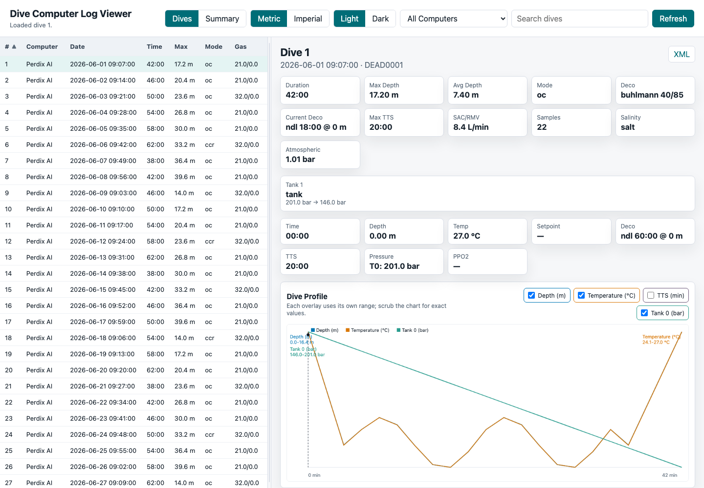
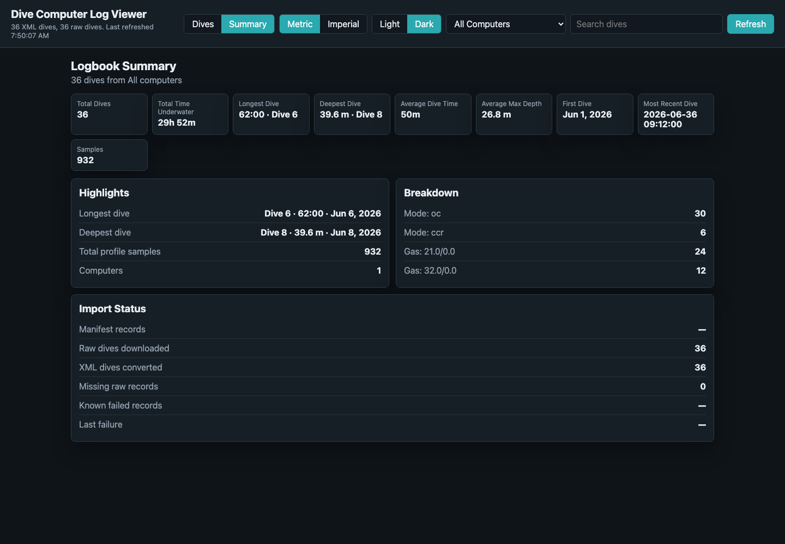

# Dive Computer Log Viewer

Download and view dive logs from dive computers in small, resumable batches
without building one huge in-memory export.

## Project Motivation

This app exists because large dive-log imports can fail in the existing apps I
tried. With hundreds of dives, the transfer can time out or the importer can run
out of memory before anything useful is saved.

The goal is to make export incremental and recoverable:

- Download one dive at a time.
- Write each raw dive to disk immediately.
- Resume from the first missing dive after a Bluetooth timeout.
- Convert and view whatever has already been downloaded while the rest of the
  logbook is still in progress.
- Avoid building one huge in-memory export object.

The current working downloader uses the native macOS CoreBluetooth tool in
`tools/shearwater_download.swift`. It scans for Shearwater-compatible BLE
computers, prompts for a choice when multiple computers are nearby, and stores
downloads separately per computer. The original `dctool` BLE path was tested,
but this machine's Homebrew `dctool` reports `Unsupported operation` for BLE
scan/open. `dctool` is still used after download to convert raw dives to XML.

## Current Status

- Tested direct BLE download:
  - Shearwater Perdix AI
  - Shearwater Petrel 3
- Current local archive, ignored by git:
  - `511` raw `.bin` files
  - `511` converted XML files
  - Perdix AI: `491` downloaded/converted dives
  - Petrel 3: `20` downloaded/converted dives
- Perdix AI observed manifest:
  - `546` active records across `12` manifest pages
  - Records `492-546` consistently reject body download with `7F3531`
  - Working assumption: stale manifest entries after circular log memory wrap
- Download format: one raw `.bin` file per dive
- XML conversion: verified with `dctool parse`
- Viewer:
  - Reads `data/xml/**/*.xml` on demand
  - Supports per-computer filtering
  - Uses chronological display numbers per computer
  - Loads full sample data only for the selected dive

## Manifest vs Downloadable Data

The manifest is an index of dive records advertised by the computer. It is not
proof that every indexed dive body is still readable. On the original Perdix AI
test computer, the manifest reported `546` active records, but records after the
last successfully downloaded range began returning protocol rejection `7F3531`
even when retried with manifest-bounded sizes.

The working assumption is that these are stale manifest entries pointing at log
storage that has wrapped or been overwritten by the dive computer's circular
memory. The downloader treats this as recoverable:

- Successfully downloaded raw files are kept.
- `--skip-existing` resumes from missing records without re-reading good dives.
- `--continue-on-error` records failures and keeps moving through the batch.
- The viewer Summary tab reports raw/XML counts and known failed records from
  the logs. Its import-status block is currently log-derived and should be
  treated as advisory when multiple computers have been imported; per-computer
  status is a future improvement.

This is documented as observed behavior, not a confirmed Shearwater protocol
guarantee. If an unavailable record is later proven recoverable, the raw/XML
layout still allows that individual dive to be filled in without changing the
rest of the logbook.

## Why This Helps

Some dive apps build one large XML/database object during import. With hundreds
of dives and rich sample data, that can fail with an out-of-memory error.

This downloader writes each dive as soon as it finishes. If the Bluetooth
session times out, already-written dives remain on disk and the next run resumes
from the first missing dive for that computer.

## Requirements

- macOS with Bluetooth enabled
- Swift toolchain: `swift` / `swiftc`
- `dctool` from `libdivecomputer` for XML conversion
- Shearwater dive computer in Bluetooth/upload mode when prompted

Verified locally:

```sh
dctool version
# libdivecomputer version 0.9.0
```

## Build

Compile the downloader once and reuse the binary during repeated Bluetooth
windows:

```sh
mkdir -p bin
swiftc tools/shearwater_download.swift -o bin/shearwater_download
```

## Recommended Download Workflow

Run a batch. If `--start` is omitted, the downloader scans the raw output
directory for the connected computer and starts at the first missing dive.

```sh
bin/shearwater_download --count 10 --skip-existing --output-dir data/raw
```

At startup it prompts:

```text
Put your Shearwater computer into Bluetooth/upload mode, then press Enter to start scanning.
```

Put the dive computer into Bluetooth/upload mode, then press Enter. If one
Shearwater-compatible computer is found, it is selected automatically. If more
than one is found, the downloader lists them and asks which one to use. The
selected advertised name is also used to choose the default `dctool` conversion
device, for example `Shearwater Perdix AI` or `Shearwater Petrel 3`.

Before downloading, it logs a summary like:

```text
Before download: found 546 dives in 12 manifest pages; 17 downloaded, 529 remaining; next missing dive is 18
```

After the batch, it logs an updated summary and a ready-to-run next command:

```text
After download: found 546 dives in 12 manifest pages; 27 downloaded, 519 remaining; next missing dive is 28
Next batch command: bin/shearwater_download --start 28 --count 10 --skip-existing --output-dir ... --log-dir logs
```

At the end of each batch it prompts to convert that batch to XML. The default is
yes:

```text
Convert this batch to XML? [Y/n]
```

Before exiting, the downloader sends the Shearwater shutdown command that asks
the computer to leave Bluetooth/upload mode.

## Useful Commands

List all available dive records without downloading dive bodies:

```sh
bin/shearwater_download --list-only --output-dir data/raw
```

Download a specific batch:

```sh
bin/shearwater_download --start 28 --count 10 --skip-existing --output-dir data/raw
```

Download one dive as a validation run:

```sh
bin/shearwater_download --count 1 --skip-existing --output-dir data/raw
```

Skip the startup Bluetooth prompt for unattended/scripted runs:

```sh
bin/shearwater_download --count 10 --skip-existing --output-dir data/raw --no-prompt
```

Skip the XML conversion prompt:

```sh
bin/shearwater_download --count 10 --skip-existing --output-dir data/raw --no-convert-prompt
```

Override the XML output directory:

```sh
bin/shearwater_download --count 10 --skip-existing --output-dir data/raw --xml-dir data/xml
```

Force a specific advertised name or UUID instead of auto-discovery:

```sh
bin/shearwater_download --target Petrel --count 10 --skip-existing --output-dir data/raw --xml-dir data/xml
```

Override the `dctool` parser used for XML conversion:

```sh
bin/shearwater_download --target Petrel --count 10 --skip-existing --output-dir data/raw --xml-dir data/xml --dctool-device "Shearwater Petrel 3"
```

Each downloader run writes a timestamped log to `logs/` by default. Override it
with:

```sh
bin/shearwater_download --count 10 --skip-existing --output-dir data/raw --log-dir logs
```

## Convert Existing Raw Files

Convert all downloaded raw files to readable XML:

```sh
python3 scripts/convert_raw_to_xml.py
```

Convert one raw file:

```sh
python3 scripts/convert_raw_to_xml.py data/raw/perdix-ai.0001.6A3F87F6.bin
```

The XML includes dive metadata plus per-sample profile data such as time, depth,
temperature, setpoint, deco/NDL/TTS, and tank pressures when present.

## Local Viewer

Start the viewer server:

```sh
python3 scripts/serve_viewer.py
```

For alternate data locations, pass explicit directories:

```sh
python3 scripts/serve_viewer.py --xml-dir data/xml --raw-dir data/raw --log-dir logs
```

Open:

```text
http://127.0.0.1:8080
```

Screenshots below use a sanitized demo fixture, not local dive data.





The viewer reads `data/xml/**/*.xml` on demand. You can keep downloading and
converting dives in another terminal; click **Refresh** in the browser to rescan
the XML directory.

The viewer accepts optional URL parameters for shareable views and repeatable
screenshots:

```text
?theme=light|dark&view=dives|summary&units=metric|imperial&select=first
```

Use the **Summary** view to see aggregate logbook stats such as total dives,
total time underwater, longest dive, deepest dive, average dive time, average max
depth, first/most recent dive, mode breakdown, and gas breakdown. The summary
respects the current computer filter and search text.

Use the **Computer** filter to narrow the list by dive computer. Legacy
root-level XML files, if present, are labeled `Shearwater Perdix AI`. XML files
inside a device directory are labeled from that directory name, including the
serial when available.

Click any dive list column header to sort ascending or descending. The selected
sort column and direction are saved locally. The `#` column is a chronological
display number per dive computer, so each computer's earliest converted dive is
number `1`. The original computer record number is still preserved in filenames,
download progress, and the dive detail subtitle.

Drag the divider between the dive list and detail pane to resize the layout. The
chosen list width is saved locally.

Use the **Metric** / **Imperial** toggle in the toolbar to switch displayed
depth, temperature, and pressure units. The XML stays metric; conversion happens
in the browser.

Use the **Light** / **Dark** toggle to switch themes. The viewer defaults to the
system color preference and remembers your choice locally.

The selected dive uses a single combined profile chart. Use the checkboxes to
show or hide depth, temperature, and tank pressure overlays. Each selected
overlay is scaled to its own range so values with very different units can be
compared visually; colored range labels show the min/max for each series. Move
the pointer over the chart to scrub the dive; the readout shows the nearest
sample's exact time, depth, temperature, setpoint, TTS, and tank pressure.

The viewer also exposes decompression and gas-use fields when present:

- Deco model, gradient factors, current/last deco status, and max TTS.
- TTS can be selected as a chart overlay.
- PPO2 sensor readings can be selected as chart overlays if the XML contains
  `<ppo2>` samples, including multiple sensors for CCR dives.
- SAC/RMV is calculated only when enough information is available. Pressure drop
  alone is not enough; tank volume and average depth are required. If tank
  volume is missing from the XML, the viewer marks SAC/RMV unavailable instead
  of guessing a cylinder size.

The summary endpoint only loads lightweight dive metadata:

```text
GET /api/dives
```

Full sample data is loaded only for the selected dive:

```text
GET /api/dive/<relative-xml-file>
```

This keeps browser memory usage low even when the computer has hundreds of
dives.

## Output Layout

Downloaded files are grouped by dive computer when possible. The existing
Perdix AI files have been migrated into a local alias directory:

```text
data/raw/perdix-ai-1/perdix-ai.0001.<fingerprint>.bin
data/raw/perdix-ai-1/perdix-ai.0002.<fingerprint>.bin
```

```text
data/xml/perdix-ai-1/perdix-ai.0001.<fingerprint>.xml
data/xml/perdix-ai-1/perdix-ai.0002.<fingerprint>.xml
```

For a newly connected computer, the downloader creates a per-computer directory
based on the target name and serial:

```text
data/raw/shearwater-perdix-<serial>/perdix-ai.0001.<fingerprint>.bin
data/xml/shearwater-perdix-<serial>/perdix-ai.0001.<fingerprint>.xml
```

That means you can pause the Perdix AI download with records remaining, connect
a different Shearwater computer, and it will start from that computer's first
missing dive in its own directory. When you reconnect the original AI, the
downloader finds matching files in `perdix-ai-1` and resumes from the first
missing AI dive.

The next-batch command printed by the downloader still points at the base
directories:

```text
--output-dir data/raw --xml-dir data/xml
```

Keep using the base directories. The downloader chooses the correct per-computer
subdirectory after it reads the connected computer's serial and manifest.

Logs:

```text
logs/shearwater-download-YYYYMMDDTHHMMSSZ.log
```

## Diagnostic Tools

Scan for nearby BLE devices:

```sh
swift tools/ble_scan.swift 20
```

Inspect the Shearwater BLE service and characteristic:

```sh
swift tools/ble_inspect.swift Petrel 20
```

Read harmless device metadata:

```sh
swift tools/shearwater_probe.swift Petrel
```

## Device Metadata

The native probe currently reads the same harmless identifiers used by
libdivecomputer's Shearwater support:

```text
0x8010 serial number
0x8011 firmware version
0x8021 log upload metadata / logbook base address
0x8050 hardware version, if supported
0x8060 model number
```

Confirmed values from this Perdix AI:

```text
serial: redacted
firmware: V102 Classic
model: 06
logupload: 018000000000020080
```

The protocol also supports writing time values for time synchronization, but
this project does not currently write settings to the computer. Broader device
settings may exist, but they are not documented in libdivecomputer's public
Shearwater support as stable readable identifiers. Treat unknown identifiers as
reverse-engineering work and keep probes read-only unless there is a clear
reason to write.

## Speed Notes

The transfer is slow because the tested Shearwater BLE protocol is
block-by-block:

```text
host requests block N
computer sends block N
host requests block N+1
computer sends block N+1
```

The downloader already uses `writeWithoutResponse` when available and removes
avoidable host-side sleeps. The remaining bottleneck is the device/protocol
round-trip, not CPU. Multithreading the BLE download is unlikely to help and
could desynchronize the transfer.

Practical tips:

- Keep the dive computer close to the Mac.
- Use `bin/shearwater_download`, not `swift tools/shearwater_download.swift`,
  during repeated runs.
- Use `--skip-existing` on every batch.
- Use batch sizes that fit inside the dive computer's Bluetooth timeout.
- Convert XML after each batch or offline from existing raw files.

## Older Wrapper

`scripts/perdix_fetch.py` is the original wrapper around `dctool download`.
It remains in the repo for reference, but the current working download path on
this machine is `bin/shearwater_download`.
